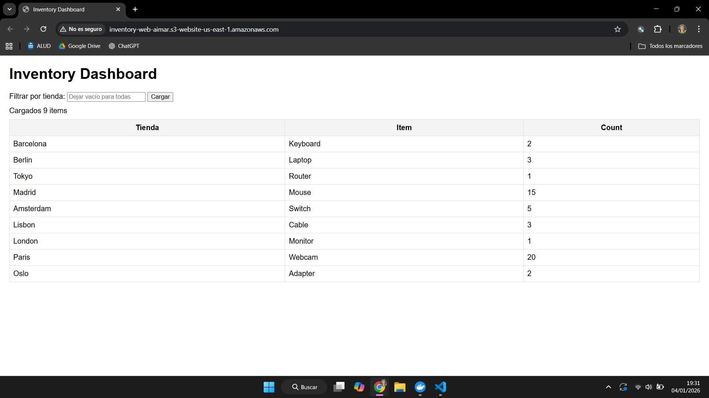
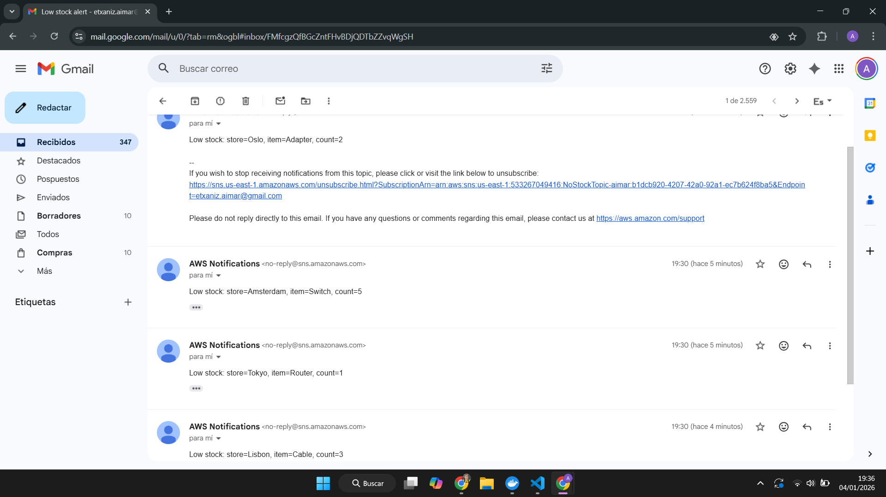

# Evidencias de Ejecución

## 1. Captura de la web mostrando inventario cargado

### Dashboard web desplegado en S3

La interfaz web está alojada en **S3 Static Website Hosting** y consume datos desde **API Gateway HTTP API v2**.

**URL:** http://inventory-web-aimar.s3-website-us-east-1.amazonaws.com



### Descripción:
- **9 items** cargados desde CSV procesados por Lambda
- Tabla HTML con columnas: Tienda, Item, Count
- Filtro funcional por tienda (input superior)
- Botón "Cargar" refresca datos desde la API
- Datos obtenidos mediante `fetch()` a API Gateway

---

## 2. Copia/pega de respuesta de la API para `/items`

### Endpoint HTTP API Gateway

**URL:** https://t965jjb16m.execute-api.us-east-1.amazonaws.com/items  
**Método:** GET  
**Status:** 200 OK  
**Content-Type:** application/json

### Response JSON completo:

```json
{
    "items": [
        {"Store": "Barcelona", "Item": "Keyboard", "Count": 2},
        {"Store": "Berlin", "Item": "Laptop", "Count": 3},
        {"Store": "Tokyo", "Item": "Router", "Count": 1},
        {"Store": "Madrid", "Item": "Mouse", "Count": 15},
        {"Store": "Amsterdam", "Item": "Switch", "Count": 5},
        {"Store": "Lisbon", "Item": "Cable", "Count": 3},
        {"Store": "London", "Item": "Monitor", "Count": 1},
        {"Store": "Paris", "Item": "Webcam", "Count": 20},
        {"Store": "Oslo", "Item": "Adapter", "Count": 2}
    ]
}
```

### Descripción:
- Lambda `get_inventory_api` realiza `scan()` en DynamoDB
- Serialización correcta de tipos `Decimal` mediante `DecimalEncoder`
- CORS habilitado (`Access-Control-Allow-Origin: *`)
- Payload Format Version 2.0 (AWS_PROXY integration)

---

## 3. Captura del email de SNS por stock bajo

### Notificaciones automáticas vía Amazon SNS

Lambda **notify_low_stock** monitorea **DynamoDB Streams** y detecta items con `Count ≤ 5`, publicando alertas en el topic SNS **NoStockTopic-aimar**.



### Descripción:
- **Suscripción confirmada:** etxaniz.aimar@gmail.com
- **Items que dispararon alertas** (Count ≤ 5):
  - Barcelona - Keyboard (2)
  - Berlin - Laptop (3)
  - Tokyo - Router (1)
  - Amsterdam - Switch (5)
  - Lisbon - Cable (3)
  - London - Monitor (1)
  - Oslo - Adapter (2)
- **Remitente:** AWS Notifications (no-reply@sns.amazonaws.com)
- **Trigger:** INSERT events en DynamoDB Streams procesados por Lambda

---


